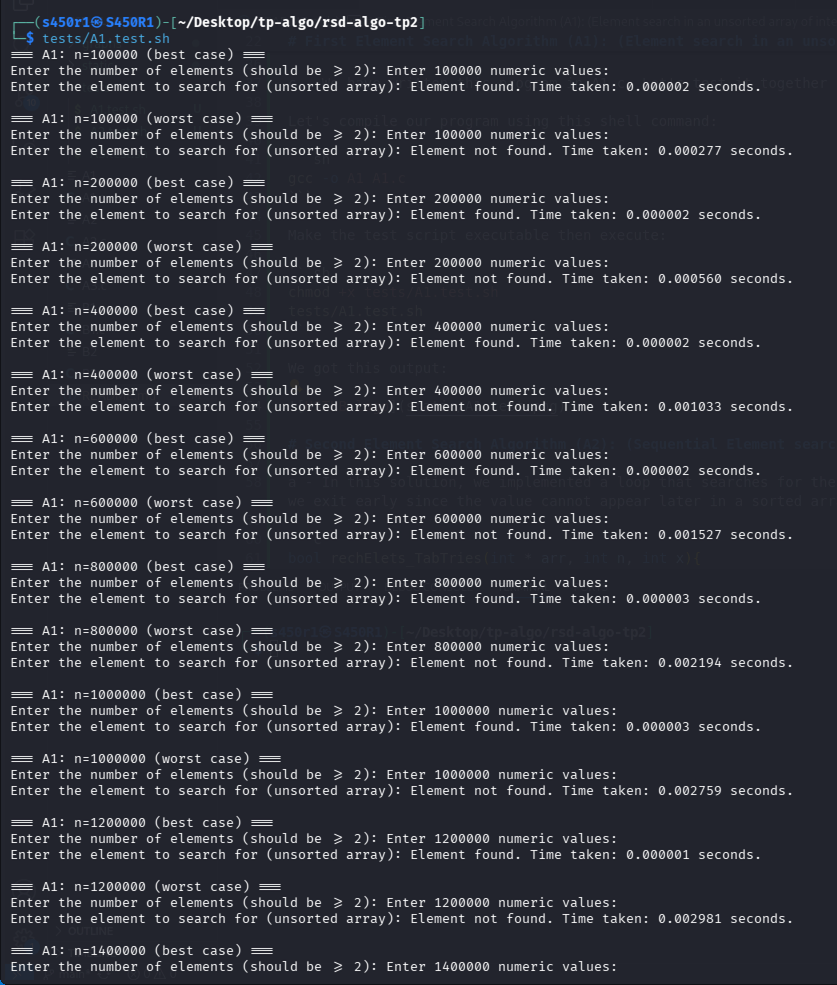
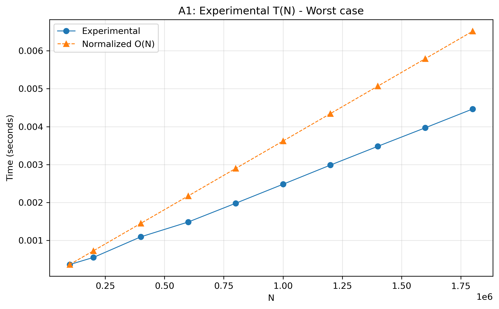
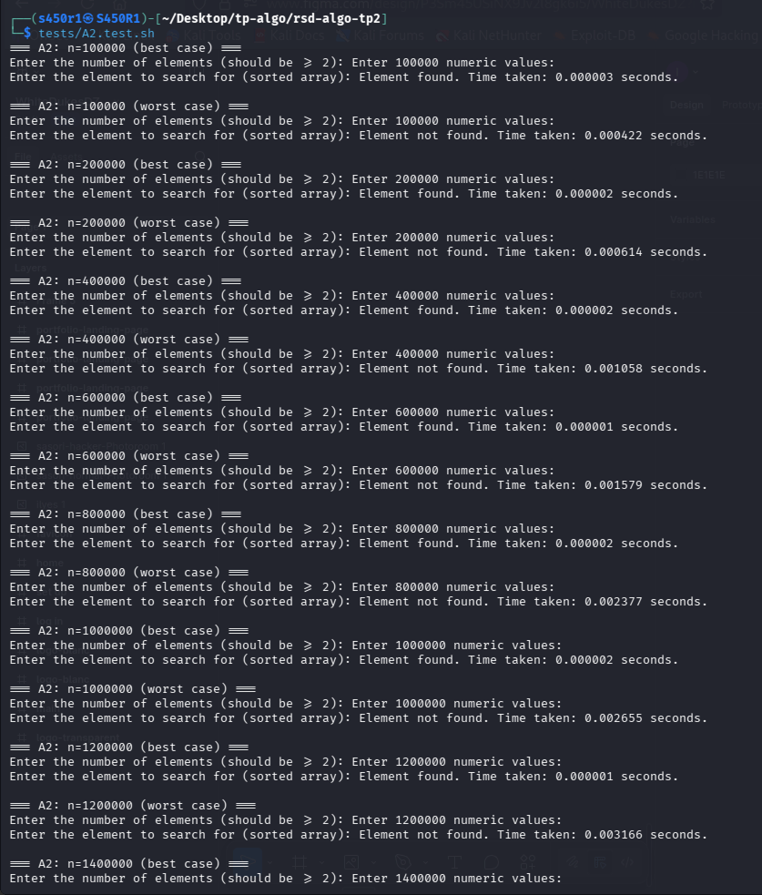
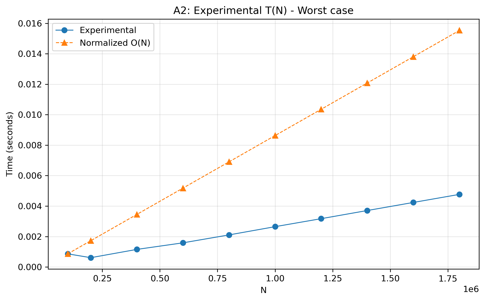
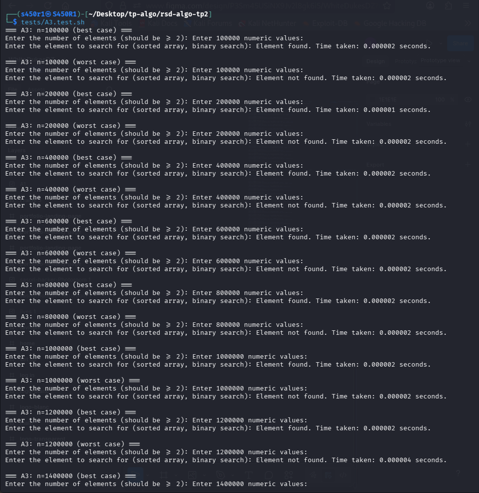
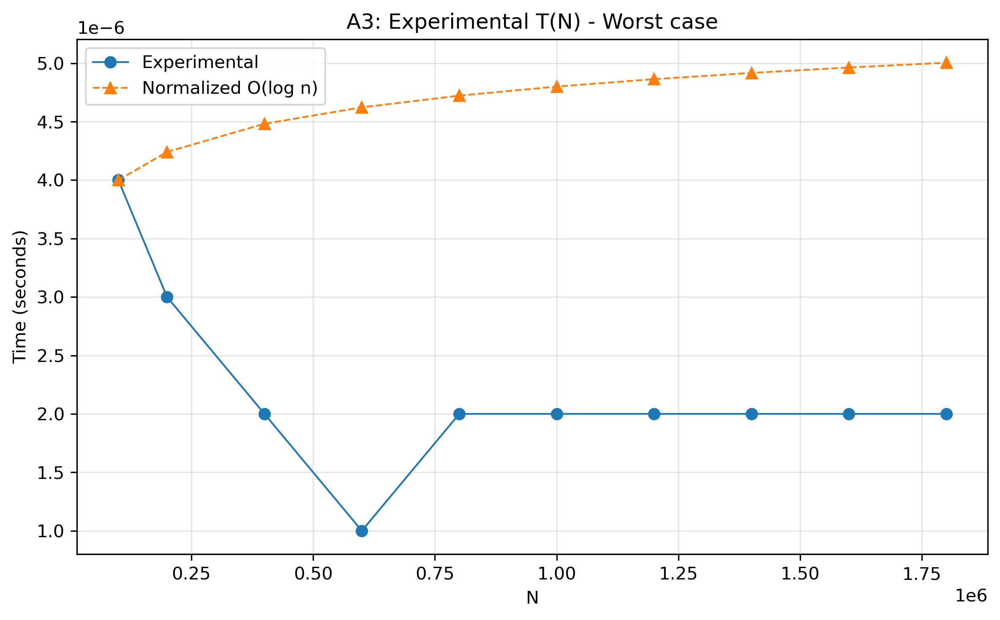

# Introduction


This repository was done as part of the practical activities we are doing in Distributed Algorithms and Complexity for speciality of Distributed Networks. Faculty of Computer Science, University of Sciences and Technology of Houari Boumedienne under the supervision of Dr. Imane Messaoudi.


This was done by:

- Ilyes Medjedoub (S450R1).

- Rawa Tesnim El Jenna Beddiar

- Bouzouad Rayane Fouzi.

- Okba Moulahoum.

You can find the instructions given by our teacher in `static/instructions.pdf`. The main subject is `Element search`. The goal from this practical activity is to test different methods for the same problem taking execution time in consideration.

This practical activity covers advanced algorithm analysis exercises focused on search algorithms (sequential search, binary search). It also covers algorithms for finding the maximum and minimum in an unsorted array, comparing a naïve method with a more efficient pairwise comparison approach.

# First Element Search Algorithm (A1): (Element search in an unsorted array of integers)

a - In this solution, we implemented a loop that will search for the integer `x` in every integer from the table `arr` from `i=0` to `i=n` (length of `arr`). 

```c
bool rechElets_TabNonTries(int * arr, int n, int x){
    for(int i = 0; i < n; i++){
        if(arr[i] == x) return true;
    }
    return false;
}
```

b - The theorical complexity in best case for this algorithm is `O(1)` and this happen when `arr[0]=x` (first occurence). And for the worst case is `O(n)` and this happen when `arr[n]=x` (first occurence).

c - We have written this program in A1.c. Let's test it together using the shell script at `tests/A1.test.sh`.

Let's compile our program using this shell command:

```sh
gcc -o A1 A1.c
```

Make the test script executable then execute:

```sh
chmod +x tests/A1.test.sh
tests/A1.test.sh
```

We got this output:



d - We represented the variations of execution time T(N) and complexity in worst case O(N). Since we're on Kali we used a python script to generate the graph (See graphs/A1.graph.py).

```sh
python3 graphs/A1.graph.py
```

Here is the generated graph found at `static/A1.graph.png`



d - We represented the variations of execution time T(N) and complexity in worst case O(N). Since we're on Kali we used a python script to generate the graph (See graphs/A1.graph.py).

```sh
python3 graphs/A1.graph.py
```

Here is the generated graph found at `static/A1.graph.png`


# Second Element Search Algorithm (A2): (Sequential Element search in a sorted array of integers)

a - In this solution, we implemented a loop that searches for the integer `x` in a sorted table `arr`. During the scan, if `arr[i] == x` we return `true`, and if `arr[i] > x` we exit early since the value cannot appear later in a sorted array.

```c
bool rechElets_TabTries(int * arr, int n, int x){
    for(int i = 0; i < n; i++){
        if(arr[i] == x) return true;
        if(arr[i] > x) return false; // Early exit because array is sorted
    }
    return false;
}
```

b - The theoretical complexity in the best case is `O(1)` when `arr[0] == x` or `arr[0] > x` (immediate stop). The worst-case complexity is `O(n)` when the algorithm must scan the entire array, e.g., when `x` is the largest value or not present but greater than all elements.

c - We have written this program in A2.c. Let's test it together using the shell script at `tests/A2.test.sh`.

Let's compile our program using this shell command:

```sh
gcc -o A2 A2.c
```

Make the test script executable then execute:

```sh
chmod +x tests/A2.test.sh
tests/A2.test.sh
```

We got this output:



d - We represented the variations of execution time T(N) and complexity in worst case O(N). Since we're on Kali we used a python script to generate the graph (See graphs/A2.graph.py).

```sh
python3 graphs/A2.graph.py
```

Here is the generated graph found at `static/A2.graph.png`



# Third Element Search Algorithm (A3): (Dichotomic/Binary Search in a sorted array)

a - In this solution, we use the binary search technique, which repeatedly divides the search interval by two. At each step, we compute the middle index `mid`: if `arr[mid] == x` we return `true`, if `arr[mid] < x` we continue searching in the right half, otherwise we search in the left half.

```c
bool rechElets_Dicho(int * arr, int n, int x){
    int left = 0, right = n - 1;
    while(left <= right){
        int mid = left + (right - left) / 2;
        if(arr[mid] == x) return true;
        else if (arr[mid] < x) left = mid + 1;
        else right = mid - 1;
    }
    return false;
}
```


b - The theoretical complexity in the best case is `O(1)` when the middle element matches `x` on the first check. The worst-case complexity is `O(log n)` because at each iteration the search interval is divided by two until exhaustion.

c - We have written this program in A3.c. Let's test it together using the shell script at `tests/A3.test.sh`.

Let's compile our program using this shell command:

```sh
gcc -o A3 A3.c
```

Make the test script executable then execute:

```sh
chmod +x tests/A3.test.sh
tests/A3.test.sh
```

We got this output:



d - We represented the variations of execution time T(N) and complexity in worst case O(N). Since we're on Kali we used a python script to generate the graph (See graphs/A1.graph.py).

```sh
python3 graphs/A3.graph.py
```

Here is the generated graph found at `static/A3.graph.png`




